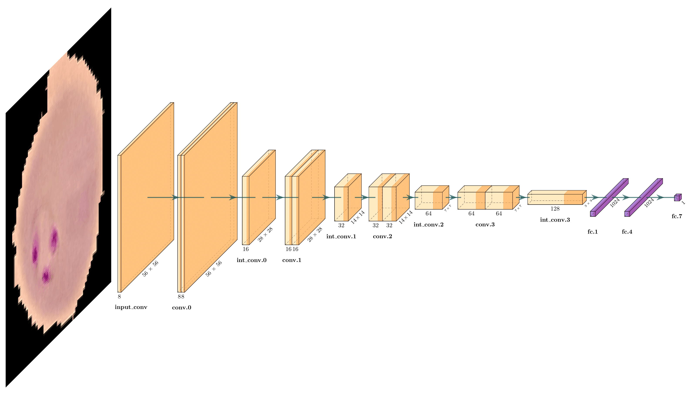

# Simple CNN with PyTorch

## Description

This repository is based on one of the university homework assignments on data visualization and serves to describe the process of building a classification model in a simple computer vision task.



## Context

The topic of the assignment is classification of cells for finding malaria cases. [This](https://www.kaggle.com/datasets/iarunava/cell-images-for-detecting-malaria) dataset is taken as a basis.

All code has been split into separate files for readability. The project has the following structure:

- The file `assignment.ipynb` contains the progress of solving the assigned task,
- The `cnn` package defines the model itself and auxiliary constants, functions and classes for working with it and data,
- `train.py` provides all the necessary functionality to train the model,
- `model.pt` contains the final machine learning model,
- The `logs` folder contains logs of training of individual models in the process of hyperparameter optimization,
- The `data` folder stores the dataset,
- `extra` contains everything that does not fit into the project structure defined above.

Priority in commenting is given to visualizations rather than to the machine learning algorithms themselves.

## Installation

```bash
git clone https://github.com/tejpaper/simple-cnn.git
cd simple-cnn
pip install -r requirements.txt
```

## References

1. [Data source](https://www.kaggle.com/datasets/iarunava/cell-images-for-detecting-malaria)
2. [Feature maps visualization tool](https://github.com/HarisIqbal88/PlotNeuralNet)

## License

MIT